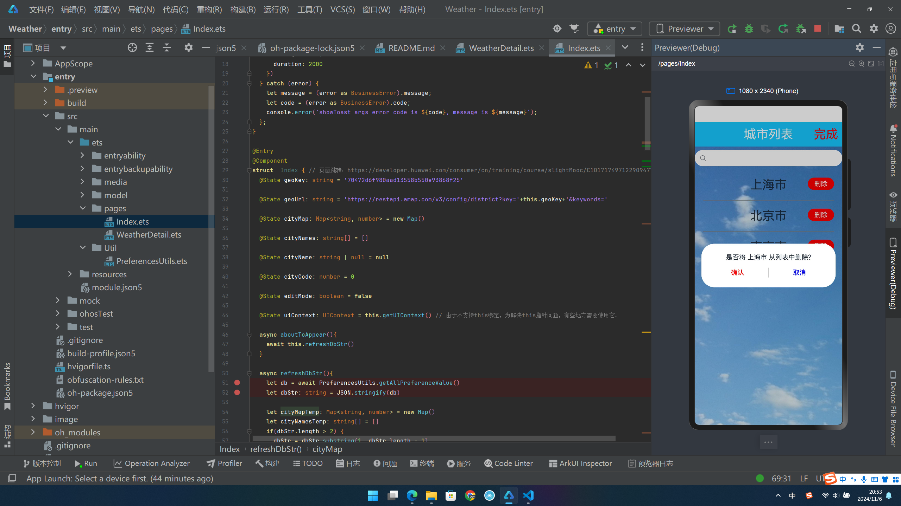

# 项目文档——天气预报

## 1.项目概述

个人信息：221250149山雨冬。

本次作业我实现了一个简单的天气预报项目，实现了查询某一地区的天气情况、收藏与管理城市列表等功能。项目支持在手机、电脑等设备上运行。

## 2.项目结构

首先由DevEco Studio生成项目基本框架。ets/media目录主要存放使用的图标、图片等资源。ets/pages下存放页面，其中Index.ets为主页面，主要包括收藏的城市列表；WeatherDetail.ets为天气详情页，使用了Tab布局分页展示实时天气和预测天气。ets/Util存放使用的工具，包括使用Preferences进行数据的持久化。

## 3.项目展示

1.项目启动后，进入主页面。包括收藏的城市列表。

2.点击右上角“编辑”，可以对列表项进行管理。

3.在搜索框内输入城市，回车、确定，可以将城市添加进列表中。其中搜索功能是通过调用高德api并进行一定的数据筛选处理得到的。

4.点击“删除”按钮，可以删除对应的列表项。

5.点击“完成”，结束编辑。

6.点击列表项，可以跳转到对应城市的天气详情页。天气详情页采用Tab布局，可以查看当前天气和预测天气。其中天气信息是通过调用高德api获取的。

（注：WebView控件无法正常在预览器上展示，可以使用真机或模拟器）

7.点击左上角返回按钮回到主页。

8.重新运行项目，发现数据成功保存。

